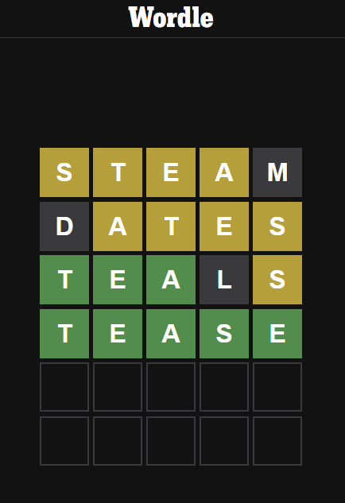
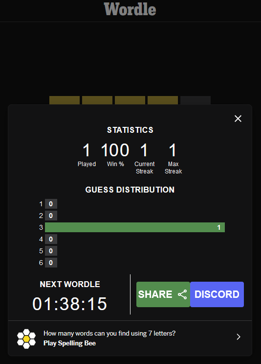
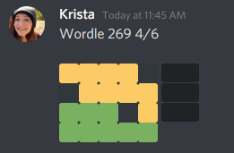
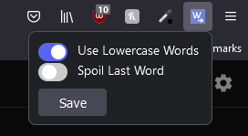
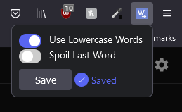

# Discord Export for Wordle

Discord export for Wordle (DEW) is a web extension that adds a secondary `Discord` share button to the NYTimes Wordle site. When the player has completed the game and clicks `Share`, Wordle normally fills the clipboard with emoji representing the guesses for the game. Clicking the new `Discord` button works similarly, but instead of the clipboard containing just the emoji for the game, it will also have the text of each guess appended to each line of emoji - hidden in a spoiler.

Take this Wordle game for example:



Upon winning the game, the user will be shown their stats and a share button:



Clicking the `Share` button will copy this text to their clipboard to paste onto social media sites:

```
Wordle 269 4/6

🟨🟨🟨🟨⬛
⬛🟨🟨🟨🟨
🟩🟩🟩⬛🟨
🟩🟩🟩🟩🟩
```

Clicking the `Discord` button instead will edit this output so that it becomes:

```
Wordle 269 4/6

🟨🟨🟨🟨⬛ ||`STEAM`||
⬛🟨🟨🟨🟨 ||`DATES`||
🟩🟩🟩⬛🟨 ||`TEALS`||
🟩🟩🟩🟩🟩
```

This output, when pasted into Discord, will render as the following:



This allows you to share your guessing journey with your friends, but keeping things spoiler-free- let's just hope they don't take a peek at those words until they've finished their game. ;)

## User Options

There are two settings available to the user to edit:

 - Use Lowercase Words (default=```false```): When set to true, this will use lowercase letters for the copied text.
 - Spoil Last Word (default=```false```): When set to true, this will add spoiler text to the last word (the Wordle answer).

These settings can be changed by navigating to the settings page for the extension in your browser. More preferably, if you have the extension button available in your toolbar, you can use this to adjust your settings.

     

> NOTE: You will need to refresh the page before the settings are used to change the output text.

# Installation

The current iteration has been tested with Firefox and Chrome.

## Firefox

1. Download `dew-<version#>-firefox.xpi` from the latest release
2. Open FireFox
3. Use `ctrl + shift + a` to open the Add-Ons Manager tab
4. Click the gear on the upper right-hand side of the screen
5. Click "Install Add-On from File"
6. Navigate to and select the XPI file you obtained from step 1
7. Head over to the [NYTimes Wordle Site](https://www.nytimes.com/games/wordle/index.html) and try it out!

## Chrome

1. Download `dew-<version#>-chrome.zip` from the latest release
2. Unzip folder to a convenient location
3. Open Chrome
4. Click the puzzle piece in the upper right-hand side of the taskbar (OR if you do not see this, type "chrome://extensions/" into the address bar)
5. In the upper right-hand corner of the screen, click on the "Developer mode" toggle button
6. Click the "Load unpacked" button that was just revealed by unlocking developer mode
7. Navigate to and select the folder you unzipped in step 2
8. Head over to the [NYTimes Wordle Site](https://www.nytimes.com/games/wordle/index.html) and try it out!
